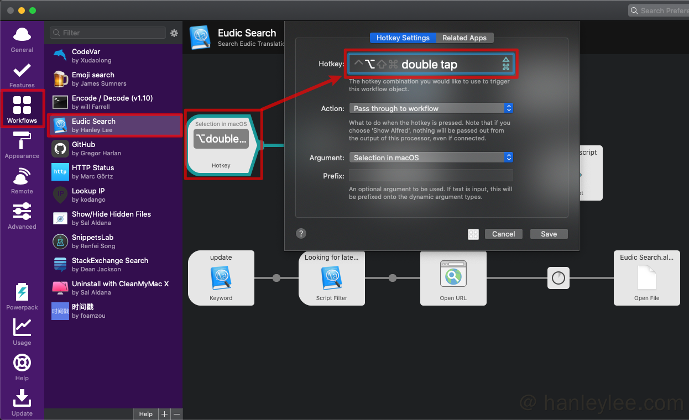
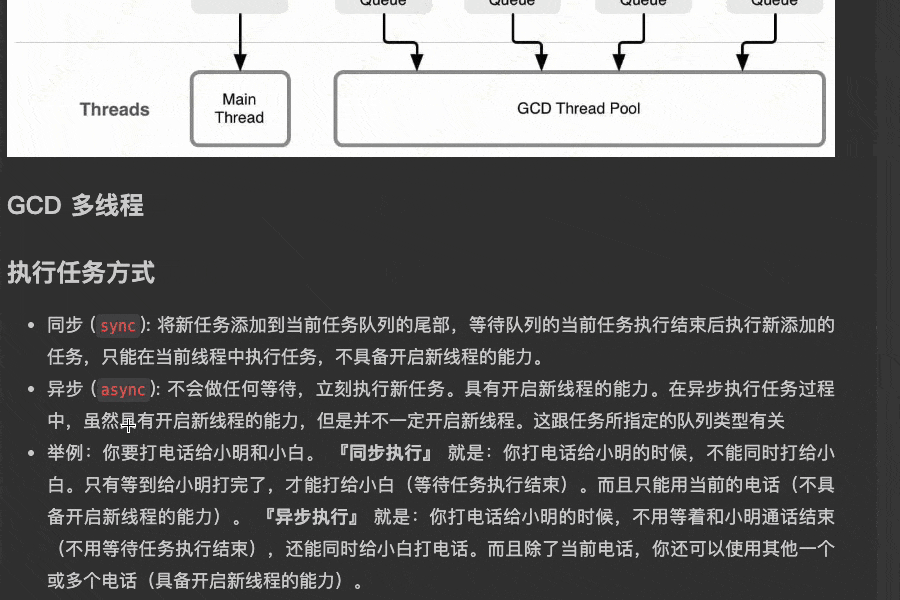
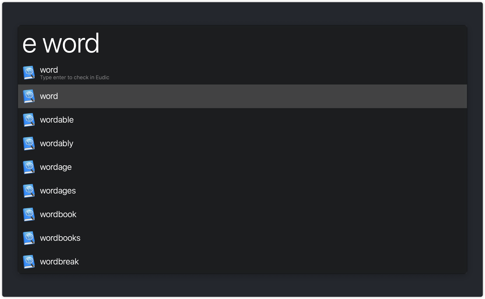
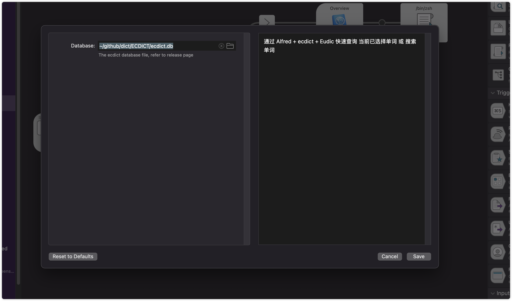
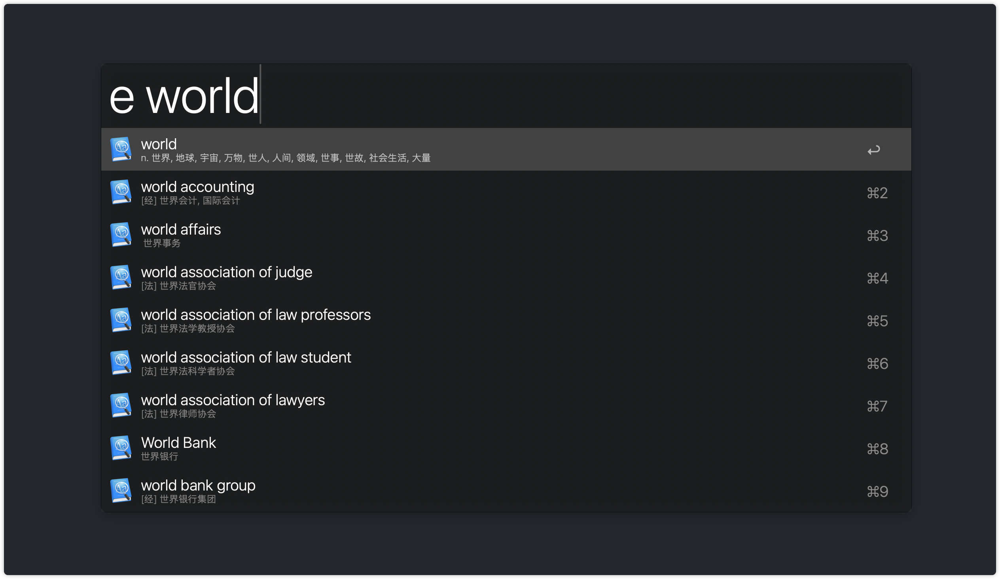

# alfred-eudic-workflow

通过 **Alfred** + [ECDICT][ECDICT] + **Eudic** 快速查询 **当前已选择单词** 或 **搜索单词**

## 目标群体

同时使用 **Eudic** 及 **Alfred Power Pack** 的用户

## 安装

1. 进入 [Releases](https://github.com/hanleylee/alfred-eudic-workflow/releases) 界面下载最新版本的 `EudicSearch.alfredworkflow` 文件
2. 双击 `EudicSearch.alfredworkflow` 文件导入 Alfred
3. 进入`Alfred Preference` → `Workflow` → `Eudic Search`, 双击 `Hotkey` 设置启动本 Workflow 的快捷键, 建议设置为 `双击 ⌥ 键`

    

4. 安装完成

## 使用

### 查询释义

1. **双击 ⌥ 键, 在有选择文本情况下直接使用选择文本进行查询, 无选择文本情况下进入自定义搜索界面**

    

2. `Alfred` 搜索框中输入关键字 `e` 进行搜索

    

### 朗读发音

搜索框激活情况下按下 `⌘ ⏎` 将由 `Eudic` 朗读单词发音

### 搜索列表

默认支持 *轻量搜索* - 使用内置轻量单词列表将前缀匹配项列出

同时支持用户配置 [ECDICT][ECDICT] 的 Sqlite 数据库替代默认 *轻量搜索*. 启用方式: 在 [Releases](https://github.com/hanleylee/alfred-eudic-workflow/releases) 界面下载 *ecdict.db* 文件, 并在 workflow 中配置 *Database* 值为该文件的本地路径

## Feature

- [x] 支持 App Store 版本的 Lite 版本 (目前支持 **官网版本** 与 **App Store 专业版**)
- [x] 支持内置单词列表进行前缀模糊匹配
- [x] 支持配置 ECDICT 进行模糊匹配并实时展示解释
- [x] 设置自动更新

## 参考

- [wensonsmith/YoudaoTranslate](https://github.com/wensonsmith/YoudaoTranslate)
- [ECDICT][ECDICT]

## 开源许可

本仓库的所有代码基于 [Apache License 2.0](http://www.apache.org/licenses/LICENSE-2.0) 进行分发与使用. 协议全文见
[LICENSE](https://github.com/hanleylee/alfred-eudic-workflow/blob/master/LICENSE) 文件.

Copyright 2021 HanleyLee

---

欢迎使用, 有任何 bug, 希望给我提 issues. 如果对你有用的话请标记一颗星星 ⭐️

[ECDICT]: https://github.com/skywind3000/ECDICT
